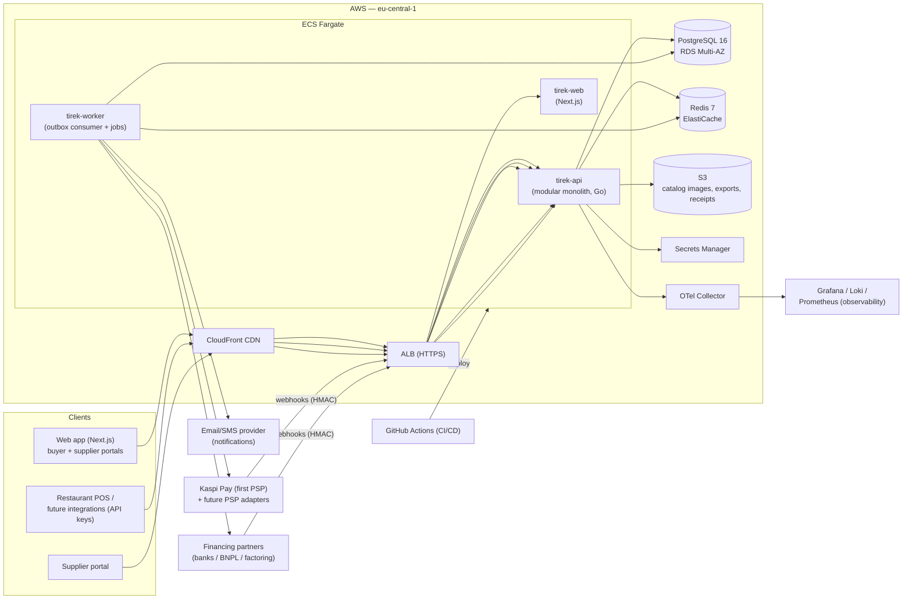

# Tirek — System Architecture

Version: 1.0 (MVP architecture)
Status: Approved

## 1. Overview

Tirek is a B2B platform connecting restaurants and food-service businesses
(buyers) with suppliers, covering procurement, orders, payments, and financing.

This document describes the MVP architecture: a **modular monolith** deployed
on AWS, built for correctness (money, audit) and speed of delivery, with module
boundaries designed so that high-traffic or high-risk domains can be extracted
into separate services later.

## 2. Goals and non-goals

### Goals
- MVP in weeks, not quarters; small team (2–4 engineers).
- Financially correct by construction: no floating-point money, idempotent
  payments, immutable double-entry ledger.
- Provider-agnostic payments and financing — swap PSPs and lending partners
  without domain changes.
- Strong tenant isolation for multi-tenant B2B data.
- Clear, documented module boundaries that allow future extraction.

### Non-goals (MVP)
- Microservices and Kubernetes. Revisit only when a concrete bottleneck proves
  they are needed (see ADR-001).
- Tirek acting as a bank, PSP, or lender. Regulated operations are delegated to
  licensed partners (processors, banks, BNPL/factoring partners).
- Real-time procurement matching, complex logistics, barcode/OCR inventory.

## 3. Technology stack (decisions)

| Layer | Choice | Notes / ADR |
|---|---|---|
| Backend | Go 1.24, chi router, pgx, sqlc, zerolog | ADR-002 |
| Frontend | Next.js 15 (App Router), TypeScript, Tailwind CSS, TanStack Query, Zod | ADR-003 |
| Database | PostgreSQL 16 (RDS), `pgcrypto` + UUIDv7 | ADR-004 |
| Query layer | sqlc (compile-time checked SQL) | ADR-004 |
| Cache | Redis 7 (ElastiCache) — sessions, rate limits, catalog cache | ADR-005 |
| Background jobs | Transactional outbox + River worker (Postgres-backed queue) | ADR-006 |
| AuthN | JWT access + rotating refresh tokens, argon2id passwords | ADR-007 |
| AuthZ | RBAC roles/permissions + Postgres Row-Level Security | ADR-008 |
| Money | `BIGINT` minor units + ISO 4217 currency; **no floats** | ADR-009 |
| Payments | Provider-agnostic adapter pattern (first: Kaspi Pay; mock for dev) | ADR-010 |
| Financing | External regulated partners via adapters (factoring/BNPL); never Tirek's own credit | ADR-010 |
| Ledger | Double-entry journal, immutable postings, reconciliation | ADR-012 |
| API | REST/JSON over HTTPS, `/v1`, RFC 7807 errors, cursor pagination | ADR-011 |
| Cloud | AWS eu-central-1: ECS Fargate, RDS, ElastiCache, S3, Secrets Manager | ADR-013 |
| Observability | OpenTelemetry traces + Prometheus metrics + Loki logs + Grafana | ADR-014 |
| CI/CD | GitHub Actions → ECR → ECS Fargate | infra doc |
| Testing | Go table-driven + testcontainers; Vitest; Playwright (critical flows) | infra doc |

## 4. System diagram

## 5. Runtime processes

| Process | Role |
|---|---|
| `tirek-api` | HTTP API. All inbound traffic (web, portals, provider webhooks). Stateless, horizontally scalable. |
| `tirek-worker` | Consumes the transactional outbox; executes payment intents, settlement checks, notifications, finance jobs. Idempotent by job key. |
| `tirek-web` | Next.js SSR app; BFF calls the API server-side (keeps tokens off the browser for refresh flows; CSP-friendly). |

All three are deployed together (one ECS cluster, three services) so that
eventual service extraction requires no operational change to the remaining code.

## 6. Modules

Each module owns its tables and exports a Go package boundary. Dependencies
point **inward** toward `platform` (shared kernel: DB, config, money, ids,
events); cross-module calls go through in-process interfaces that become RPC
surfaces if the module is extracted.

| Module | Responsibility | Owns tables (prefix) |
|---|---|---|
| identity | Users, authn, sessions, login/refresh | `users`, `sessions`, `auth_events` |
| organizations | Tenants, memberships, RBAC | `organizations`, `memberships`, `roles`, `permissions` |
| restaurants | Restaurant groups, outlets | `restaurants`, `outlets` |
| suppliers | Supplier profiles, contacts, rating | `suppliers`, `supplier_contacts` |
| catalog | Product categories, products, prices | `catalog_categories`, `catalog_products`, `catalog_prices` |
| procurement | RFQs → purchase orders | `rfqs`, `rfq_items`, `purchase_orders`, `po_items` |
| orders | Sales-side order records (mapping PO ↔ outlet) | `orders` |
| invoicing | Supplier invoices, approval, matching | `invoices`, `invoice_items` |
| payments | Payment intents, PSP adapters, webhooks, refunds | `payment_intents`, `payments`, `refunds`, `psp_accounts` |
| financing | Financing applications, agreements, repayments | `financing_applications`, `financing_agreements`, `repayment_entries` |
| ledger | Chart of accounts, journal, postings | `ledger_accounts`, `journal_entries`, `journal_lines` |
| notifications | Email/SMS, preferences, outbox-driven | `notifications`, `notification_preferences` |
| audit | Append-only audit trail | `audit_logs` |
| platform (shared) | Config, HTTP, money, ids, events, db, observability | `outbox_events`, `webhook_events`, `idempotency_keys` |

### Extraction criteria (future)
Extract a module into a service only when at least one of:

1. an independent scaling requirement (e.g. webhook ingress load);
2. a security boundary requirement (e.g. ledger access restricted to a
   dedicated service);
3. a team ownership requirement (two teams colliding on the same code).

The outbox + event contracts make extraction a mechanical step: in-process call
becomes a `tirek.events.<module>.<action>` outbox event consumed by the new
service.

## 7. Data flow (primary scenario: buyer pays a supplier invoice)

1. Buyer web app creates a purchase order → `orders` module.
2. Supplier confirms; goods delivered; supplier issues invoice → `invoicing`.
3. Buyer approves invoice → payment intent created (`payments`) with an
   idempotency key; a `journal_entry` (accrual) is posted in `ledger`.
4. Worker calls the PSP adapter (Kaspi Pay) → payer redirected/QR code.
5. PSP webhook (HMAC-verified, deduplicated) marks intent paid → ledger posts
   settlement entries → notifications → supplier gets paid (Payout).

Full flow in [financial-architecture.md](financial-architecture.md).

## 8. MVP vs future scaling

| Concern | MVP | Future |
|---|---|---|
| Deployment | Single cluster, 3 Fargate services, 1×RDS | Extract modules → services; RDS read replicas; shard by tenant |
| Queue | Postgres outbox + River | River already survives moderate load; migrate to Kafka/SQS if throughput demands |
| Multi-tenancy | Shared schema + RLS | Tenant-aware partitioning; dedicated instances for enterprise tenants |
| Data volume | Catalog in Postgres | Redis cache + S3-backed media + search (OpenSearch) when catalog > ~10⁶ SKUs |
| Observability | OTel + Grafana stack | Alerting on SLOs, cost dashboards |
| Growth markets | Kazakhstan (KZT, Kaspi Pay) | Currency-aware pricing engine, more PSP adapters (ADR-010) |

Do not build any of the "future" column until a measured trigger exists.
