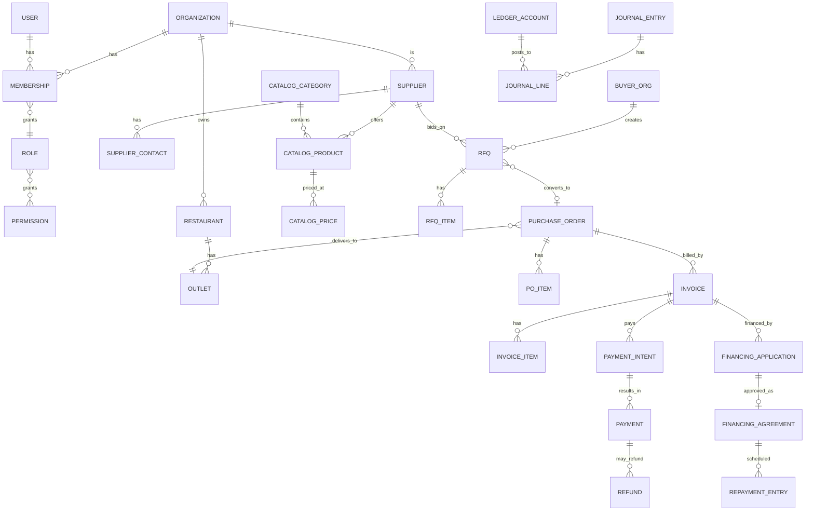
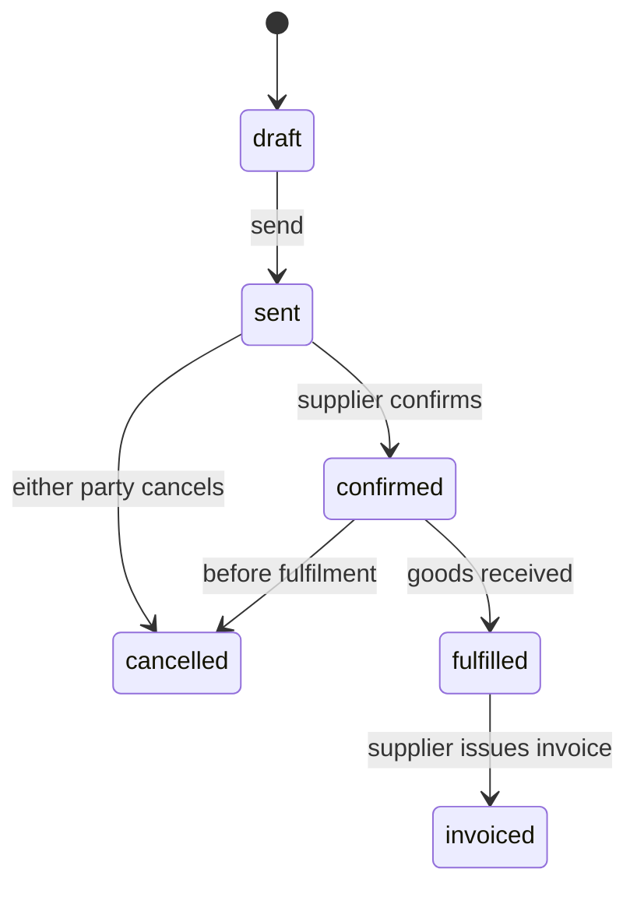
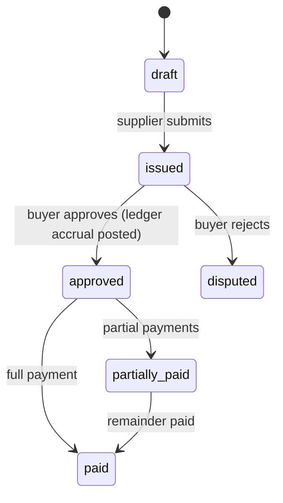
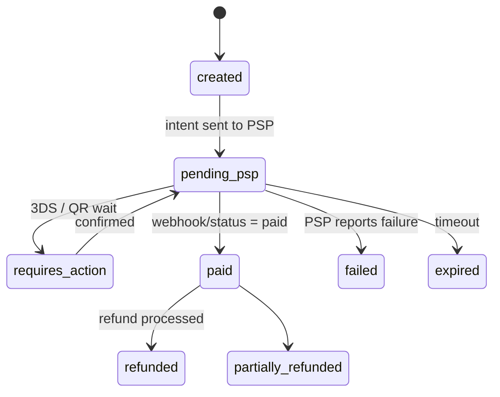
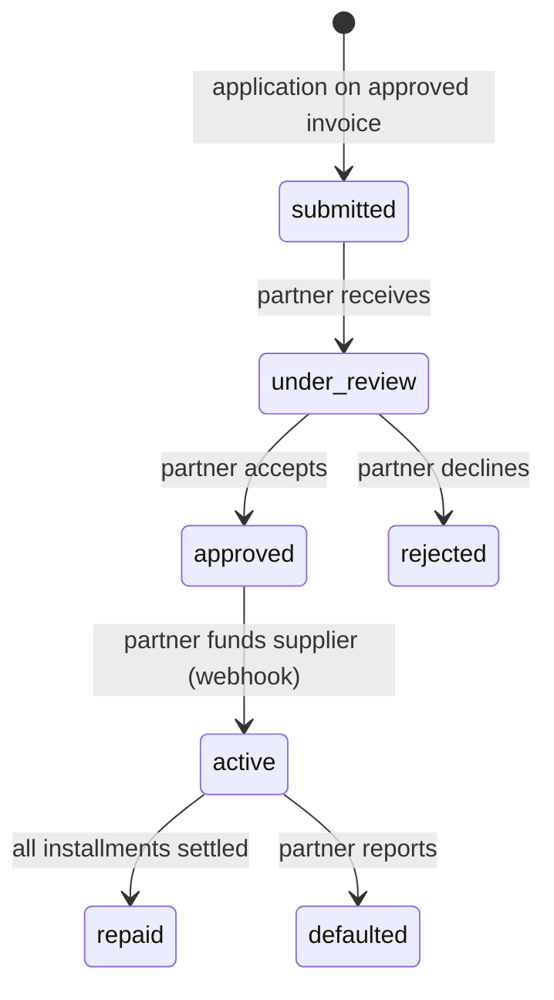

# Tirek — Domain Model

Version: 1.0 (MVP)
Status: Approved

## 1. Core concept

Two kinds of **organizations** (tenants) exist on Tirek:

- **Buyer organization** — restaurant group/chain/food-service business. Owns
  restaurants and outlets.
- **Supplier organization** — food or goods supplier. Owns a catalog and sells
  to buyers.

All data is scoped to an organization; cross-organization references are
explicit and controlled (a supplier only sees orders addressed to it).

## 2. Entities by module

### 2.1 Identity / Organizations

| Entity | Description |
|---|---|
| `users` | Global identity (email, password hash, state). A user may belong to many organizations. |
| `organizations` | Tenant. `type`: `buyer` or `supplier`. Country, default currency, tax (IIN/BIN) data. |
| `memberships` | User ↔ organization with role. A user can hold different roles in different orgs. |
| `roles` | Named role sets: `owner`, `admin`, `procurement`, `accountant`, `viewer`, `supplier_manager`. |
| `permissions` | Fine-grained capabilities (`orders.create`, `payments.approve`, …). Roles map to permissions. |

A user authenticates globally; **authorization is always evaluated per active
organization** (tenant header / JWT claim `org_id`).

### 2.2 Restaurants

| Entity | Description |
|---|---|
| `restaurants` | Restaurant groups (chain) belonging to a buyer org. |
| `outlets` | Physical locations. Address, delivery zone, default supplier list. Orders/purchases are per-outlet. |

### 2.3 Suppliers

| Entity | Description |
|---|---|
| `suppliers` | Supplier organization profile: legal name, BIN/IIN, bank details (payout account), payment terms (net 14/30). |
| `supplier_contacts` | Contact people, phones, emails, roles (sales manager, accountant). |

### 2.4 Catalog

| Entity | Description |
|---|---|
| `catalog_categories` | Category tree per supplier. |
| `catalog_products` | SKUs: name, unit (kg, box, pcs), VAT rate, image S3 key, active flag. |
| `catalog_prices` | Price point per product: currency, unit price (minor units), effective-from date, volume tiers. |

### 2.5 Procurement

| Entity | Description |
|---|---|
| `rfqs` | Request for Quotation: buyer→supplier, list of items, delivery window, status. |
| `rfq_items` | Requested product/quantity. |
| `purchase_orders` | Converted PO after quote acceptance: supplier, outlet, delivery date, totals (per currency). |
| `po_items` | Lines: product, quantity, unit price, VAT, totals. |

State machine (PO):

### 2.6 Orders

`orders` — the commercial record tying PO to an outlet purchase: order number,
PO reference, currency, totals, status. Kept as a thin projection over the PO
so that buyer-side order history and supplier-side PO history stay clean.

### 2.7 Invoicing

| Entity | Description |
|---|---|
| `invoices` | Supplier invoice for a PO. Number, dates, currency, amounts, VAT breakdown, status. |
| `invoice_items` | Lines matching `po_items` (quantity, price, amounts). |

State machine:

### 2.8 Payments

| Entity | Description |
|---|---|
| `psp_accounts` | Payment gateway credentials per organization (adapter, mode, merchant id, signing keys). |
| `payment_intents` | One intent per invoice (or partial). `amount` minor units, currency, `provider`, `status`, `idempotency_key`. |
| `payments` | A successful captured payment, tied to intent; provider reference. |
| `refunds` | Full/partial refund of a payment; always paired with ledger reversal. |

### 2.9 Financing (external partners)

Tirek **never lends money**. It facilitates external, regulated financing:

| Entity | Description |
|---|---|
| `financing_applications` | Buyer request to finance an approved invoice via partner. Product type (factoring / BNPL / credit line), amount, term. |
| `financing_agreements` | Accepted terms from the partner: APR/fee schedule, repayment plan, partner ref. |
| `repayment_entries` | Scheduled repayment installments (principal, fee, due date, status). |

### 2.10 Ledger

| Entity | Description |
|---|---|
| `ledger_accounts` | Chart of accounts (COA) — global, immutable list. |
| `journal_entries` | Financial event header: type, reference (invoice/payment/refund id), currency, timestamps. |
| `journal_lines` | Double-entry lines: debit/credit, amount (minor units), account. Lines are **immutable**; corrections are new reversal entries. |

Every money movement (invoice accrual, payment capture, fees, refund,
financing fee, repayment) generates journal entries in the **same transaction**
as the state change (outbox pattern — see financial architecture).

### 2.11 Notifications / Audit / Platform

| Entity | Description |
|---|---|
| `notifications` | Email/SMS/push records (queued via outbox). |
| `notification_preferences` | Per-user channel opt-ins. |
| `audit_logs` | Append-only: actor, action, entity, before/after JSON, IP, org. |
| `outbox_events` | Transactional outbox for all async work. |
| `webhook_events` | Inbound provider webhooks (dedupe + processing state). |
| `idempotency_keys` | API-level idempotency for state-changing endpoints. |

## 3. Key invariants

1. Every tenant-scoped table carries `org_id` and RLS is enabled (defense in depth).
2. All money fields are `BIGINT` minor units + `CHAR(3)` currency. No `float`/`numeric` for money in application code.
3. An invoice can only be `paid` via a captured `payment`; `payments` are only created from `payment_intents` with a unique idempotency key.
4. Every state transition that moves money posts journal lines in the same DB transaction.
5. `journal_lines` are never updated or deleted; reversals are new entries.
6. Purchase orders may only reference active products and confirmed quotes.
7. Refunds never exceed the captured payment amount (checked with `FOR UPDATE` lock).
8. Financing never creates ledger entries on Tirek's own books until the partner confirms funding (webhook).
