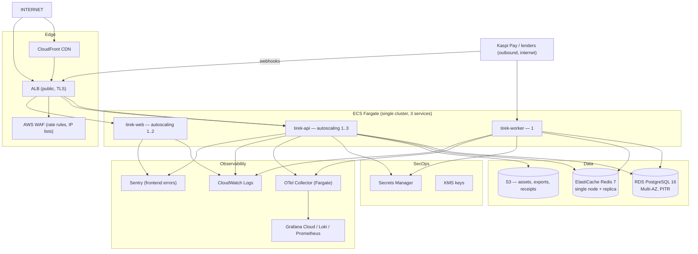
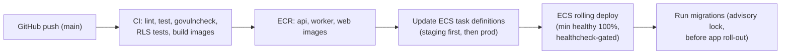

# Tirek — Infrastructure Architecture

Version: 1.0 (MVP)
Status: Approved

## 1. Cloud and region

- **AWS**, primary region **eu-central-1** (Frankfurt — lowest-latency AWS
  region to Kazakhstan; alternative `eu-west-1` recorded in ADR-013).
- Managed services preferred over self-hosted for everything except the
  application containers, which run on **ECS Fargate** (no cluster node
  management, scales to zero on demand).

## 2. Topology (production)

## 3. Environments

| Env | Purpose | Stack | Data |
|---|---|---|---|
| `local` | Developer laptop | docker compose (postgres, redis, api, worker, web) | seeded demo data |
| `staging` | CI verifies, PSP sandbox | ECS + RDS single-AZ + ElastiCache + S3 (`tirek-assets-staging`) | synthetic data |
| `production` | Real traffic | ECS + RDS Multi-AZ + ElastiCache + S3 (`tirek-assets-prod`) | real data |

Staging is a **reduced clone** of production (same task definitions, same
migrations, sandbox provider credentials) so that deploy problems surface
before production. No production data ever flows into staging.

## 4. Networking

- API + web behind the ALB in public subnets; DB/Redis in private subnets
  (no public endpoints).
- Security groups: ALB→API/Web 443 only; API/Worker→RDS 5432, →Redis 6379
  from private subnets only; egress allowlisted for provider APIs.
- VPC: 3 AZs, 3 public + 3 private subnets.
- Backup/DR egress to S3 replication.

## 5. Data layer

- **RDS**: `db.t4g.medium` staging, `db.t4g.large` production (1 TB gp3
  storage), Multi-AZ, automated backups 7 days + PITR, weekly snapshot copied
  cross-region, performance insights on.
- **ElastiCache**: Redis 7, `cache.t4g.small` + replica (production), used
  for rate limits, session index, catalog cache.
- **S3**: one bucket per env; versioning on; lifecycle 30-day IA, 90-day
  Glacier for exports; objects private, access via pre-signed URLs.

## 6. Secrets

- AWS Secrets Manager: `DATABASE_URL` (rotating), JWT secrets, provider keys,
  webhook secrets. Rotation runbook via Lambda (DB) / manual (keys).
- IAM: ECS task roles with least-privilege policies (SecretsManager:GetSecret,
  S3 bucket-scoped, KMS decrypt).

## 7. Containers and deploy pipeline

- Migrations run as a separate step before the app task definition update
  (expand-contract: additive migrations only, back-compat window).
- Rollback: previous task definition re-deployed in one action (images
  tagged `sha-<commit>`).

## 8. CI/CD (GitHub Actions)

Workflows in `.github/workflows/`:

| Workflow | Trigger | Content |
|---|---|---|
| `ci.yml` | every PR | backend: `go vet`, `golangci-lint`, `go test ./...` with testcontainers; frontend: `tsc`, `eslint`, unit tests; Trivy image scan |
| `deploy.yml` | push to `main` | build + push images, apply migrations, rolling deploy staging → promote to production (manual approval gate) |

Credentials: GitHub Environments secrets (`AWS_ACCOUNT_ID`, `AWS_REGION`,
`OIDC_ROLE_ARN` — OIDC federation, no long-lived keys in GitHub).

## 9. Observability

- **Traces**: OpenTelemetry SDK in Go/Next.js → OTLP → Grafana Tempo
  (via Grafana Cloud).
- **Metrics**: Prometheus scrape of `/metrics` (HTTP latency, DB pool,
  outbox depth, job failures, PSP latency) → Grafana dashboards.
- **Logs**: structured JSON (zerolog) → CloudWatch Logs → Loki; `request_id`
  correlation.
- **Alerts** (first set):
  - outbox depth > 1000 for 5 min
  - PSP webhook error rate > 1%
  - payment capture failure rate > 5% over 15 min
  - RDS CPU > 80% / replica lag > 30 s
  - 5xx rate > 2% over 10 min
  - failed login bursts (security)
- Sentry for frontend JS errors + backend unhandled panics.

## 10. Backups and disaster recovery

| Asset | Backup | RPO / RTO |
|---|---|---|
| PostgreSQL | RDS PITR (7 d) + cross-region weekly copy | RPO ≤ 5 min, RTO ≤ 30 min |
| S3 objects | versioning + cross-region replication | RPO ~ 0 |
| Redis | optional AOF to S3 (rebuilt on failover) | tolerated loss |
| Source/infra | git + ECR images (immutable) | — |

DR runbook: restore RDS from cross-region snapshot → re-run migrations →
point ECS task definitions at restored DB → verify smoke tests. Quarterly
drill in staging.

## 11. Cost posture (MVP)

| Service | Estimate (prod, small) |
|---|---|
| Fargate (API+worker+web, ~0.5 vCPU avg) | ~$60–120/mo |
| RDS t4g.large Multi-AZ | ~$130/mo |
| ElastiCache t4g.small | ~$30/mo |
| S3 + data transfer | ~$10/mo |
| ALB + WAF + CloudFront | ~$30/mo |
| Grafana Cloud free tier + Sentry free tier | $0 |

Total ≈ **$250–320/mo** for production. Staging ≈ $120/mo (can pause
non-business hours).

## 12. Explicit non-decisions (why not…)

- **No Kubernetes** — Fargate covers MVP scale with far less ops (ADR-013).
- **No Terraform for MVP** — ECS task definitions + CloudFormation-backed
  console setup documented in `infra/`; adopt Terraform when the team grows.
- **No multi-region active-active** — single region + cross-region backups.
- **No dedicated message broker** — Postgres outbox (ADR-006).